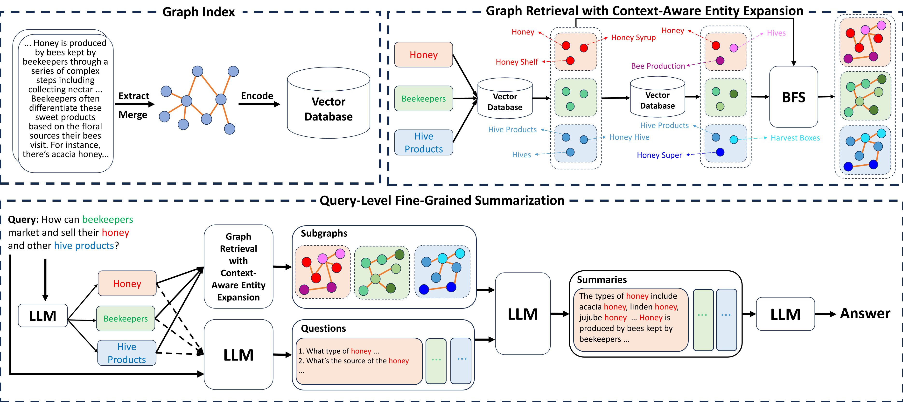

# FG-RAG: Enhancing Query-Focused Summarization with Context-Aware Fine-Grained Graph RAG



## Table of Contents

- [Usage](#usage)
    * [Installation](#installation)
    * [Configuration](#configuration)
    * [Running](#running)
    * [Evaluation](#evaluation)

## Usage

### Installation

```bash
conda create -n FG-RAG python=3.12.4 -y
conda activate FG-RAG
conda install -c conda-forge faiss-gpu -y
pip install llama_index==0.12.12
```

### Configuration

Before running, you need to change some configuration information for `Config.py` in the `Steps` directory. The specific meaning of each parameter is described in the notes in the document.

### Running

```bash
python Steps/RunFGRAG.py
```

### Evaluation

After modifying the path in the `RunEvaluate.py` file to the location of the two answer files to be compared, execute the following command:

```bash
python Steps/RunEvaluate.py
```
